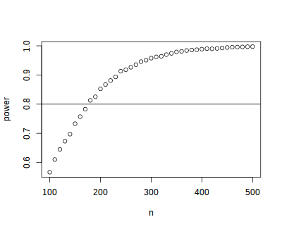

# Batch Job Examples

RCE users come from a variety of backgrounds and different people are
more proficient with different software packages. Feel free to skip to
the batch examples using the software you are most comfortable with:


## R Batch Examples

### Batch example: Simple power simulation in R

The simplest kind of batch job is one for which you just want to run the
same code multiple times, without varying any parameters. For example,
suppose that we wish to run a power simulation for a t.test with unequal
group sizes.

1.  R power simulation script

    The first step is to write a script or program to carry out the
    desired computation. The R script below simulates distributions with
    a specified mean difference, performs two-sample t-tests on the
    difference, and calculates the proportion of significant tests.

    ``` {.r .rundoc-block rundoc-language="R" rundoc-tangle="R_examples/power1/power.R"}
    ## function to simulate data and perform a t.test
    sim.ttest <- function(mu1, mu2, sd, n1, n2) {
        d <- data.frame(x = c(rep("group1", n1), rep("group2", n2)),
                        y = c(rnorm(n1, mean = mu1, sd = sd),
                              rnorm(n2, mean = mu2, sd = sd)))
        return(t.test(y ~ x, data = d)$p.value)
    }

    ##  run the function 10,000 times
    p <- replicate(10000,
                   sim.ttest(mu1 = 1,
                             mu2 = 1.3,
                             sd = 1,
                             n1 = 50,
                             n2 = 150))
    ## calculate the proportion of significant tests
    cat(length(p[p < .05])/length(p))
    ```

2.  Submit file

    If we want to run this function one million times it may take a
    while, especially if our computer is an older less powerful model.
    So let's run it on 100 separate machines (each one will simulate the
    test 10000 times). To do that we need, in addition to the R script
    above, a submit file to request resources and run the computation.

    ``` {.conf .rundoc-block rundoc-language="conf" rundoc-eval="no" rundoc-tangle="R_examples/power1/power.submit"}
    # Universe whould always be 'vanilla'. This line MUST be
    #included in your submit file, exactly as shown below.
    Universe = vanilla

    # Enter the path to the R program.
    Executable = /usr/local/bin/R

    # Specify any arguments you want to pass to the executable.
    # Here we pass arguments to make R not save or restore workspaces,
    # and to run as quietly as possible.
    Arguments = --no-save --no-restore --slave

    # Specify the relative path to the input file
    input = power.R

    # Specify where to output any results printed by your program.
    output = output/out.$(Process)
    # Specify where to save any errors returned by your program.
    error = output/error.$(Process)
    # Specify where to save the log file.
    Log = output/log

    # Enter the number of processes to request.
    # This section should always come last.
    Queue 100
    ```

    Now that we have our script and the submit file we can run submit
    the job as follows:

    1.  make a project folder for this run if it doesn't exist
    2.  save the R script (as power.R) and the submit file (as
        power.submit) in the project folder
    3.  make a sub folder named `output`
    4.  open a terminal and `cd` to the project folder
    5.  run `condor_submit power.submit` to submit the jobs to the
        cluster

3.  Aggregating results

    When your batch job is finished you are usually left with multiple
    output files that need to be aggregated. In the case of our
    simulation example, we have files `output/out.0 -- output/out99`,
    each of which contains a single number representing the proportion
    of significant tests. We can aggregate them with a simple R script,
    like this:

    ``` {.r .rundoc-block rundoc-language="R" rundoc-eval="no" rundoc-tangle="R_examples/power1/aggregate.R"}
    ## list all output files in the output directory
    output_files <- list.files("output",
                               pattern = "^out\\.[0-9]+$",
                               full.names=TRUE)

    ## read each file, convert it to a number, and take the average
    mean(as.double(sapply(
                          output_files,
                          readLines,
                          warn = FALSE)))
    ```

4.  Try it yourself!

    Download the [power simulation example
    files](R_examples/power1.zip), to the RCE, extract the zip file and
    running `condor_submit power.submit` in the `power1` directory.

### Batch example: Power simulation in R with varying parameters

The previous example was relatively simple, because we wanted to run
exactly the same code on all 100 nodes. Often however you want each node
to do something slightly different. For example, we may wish to vary the
sample size from 100 -- 500 in increments of 10, to see how power
changes as a function of that parameter. In that case we need to pass
some additional information to each process, telling it which parameter
space it is responsible for.

As it turns out, we almost already know how to do that: if you you look
closely at the submit file in the previous example you will notice that
we used `$(Process)` to append the process number to the output and
error files.

1.  Submit file passing process as an argument

    We can use the `$(Process)` macro to pass information to our
    program, like this:

    ``` {.conf .rundoc-block rundoc-language="conf" rundoc-eval="no" rundoc-tangle="R_examples/power2/power.submit"}
    # Universe whould always be 'vanilla'. This line MUST be
    #included in your submit file, exactly as shown below.
    Universe = vanilla

    # Enter the path to the R program.
    Executable = /usr/local/bin/R

    # Specify any arguments you want to pass to the executable
    # to make r not save or restore workspaces, and to
    # run as quietly as possible
    Arguments = --no-save --no-restore --slave --args $(Process)

    # Specify the relative path to the input file
    input = power.R

    # Specify where to save any errors returned by your program.
    error = output/error.$(Process)

    Log = log.txt
    # Enter the number of processes to request.
    Queue 40
    ```

    Notice that we used `--args $(Process)` to pass the process number
    to the R program. `$(Process)` will be an integer starting from `0`.

2.  R script argument processing

    Next we need to 1) retrieve the process number in our R program
    and 2) map it to the parameter space. We can retrieve the arguments
    in R like this:

    ``` {.r .rundoc-block rundoc-language="R" rundoc-eval="no" rundoc-tangle="R_examples/power2/power.R"}
    ## retrieve arguments passed from the command line.
    process <- as.integer(as.character(commandArgs(trailingOnly = TRUE)))
    ```

    We now have a variable in R that tells us which process we are. Now
    we need to map that to our parameter space; recall that we want to
    test sample sizes from 100 to 500, so we need to map `process 0` to
    `n = 100`, `process 1` to `n = 110`, `process 2` to `n = 120` and so
    on:

    ``` {.r .rundoc-block rundoc-language="R" rundoc-eval="no" rundoc-tangle="R_examples/power2/power.R"}
    ## map process to sample size parameter.
    n <- (process + 100) + (process*10 - process)
    ```

    There is one additional complication we need to handle: in the
    previous example we did need to keep track of the parameters used by
    each process because the parameters did not vary. Now that they do,
    it would be nice if we had output that recorded the value of the
    varying parameter as well as the result. We could of course just
    print the `n` parameter we calculated from the process number along
    with the result, but it will be easier to combine the outputs if we
    write them to a machine-readable format (e.g., a
    comma-separated-values file). You may have noticed that in the
    submit file above I omitted the `output` directive: that is because
    we are going to explicitly save the results in the R script, so we
    don't need the batch scheduler to save those output files for us.

    Now we can set up the simulation as before, passing the `n`
    calculated above into our simulation function, writing the results
    to files.

    ``` {.r .rundoc-block rundoc-language="R" rundoc-eval="no" rundoc-tangle="R_examples/power2/power.R"}
      ## function to simulate data and perform a t.test
      sim.ttest <- function(mu1, mu2, sd, n1, n2) {
          d <- data.frame(x = c(rep("group1", n1), rep("group2", n2)),
                          y = c(rnorm(n1, mean = mu1, sd = sd),
                                rnorm(n2, mean = mu2, sd = sd)))
          return(t.test(y ~ x, data = d)$p.value)
      }

      ##  run the function 10,000 times
      p <- replicate(10000,
                     sim.ttest(mu1 = 1,
                               mu2 = 1.3,
                               sd = 1,
                               n1 = n,
                               n2 = n))
    write.csv(data.frame(n = n, power = length(p[p < .05])/length(p)),
              row.names = FALSE,
              file = paste0("output/out", process, ".csv"))
    ```

    Now we have all the required elements to submit out job, and can do
    so using `condor_submit` as before.

3.  Aggregating results

    Each of our 40 processes produced a file in the `output` directory
    name `out<process>csv`; our next task is to aggregate these results.
    The R script below reads each of these files, joins them together
    into a single data.frame, and plots the result.

    ``` {.r .rundoc-block rundoc-language="R" rundoc-eval="no" rundoc-tangle="R_examples/power2/aggregate.R"}
    ## list all output files in the output directory
    output_files <- list.files("output",
                               pattern = "^out[0-9]+\\.csv$",
                               full.names=TRUE)

    ## read each file and append them
    results <- do.call(rbind, lapply(output_files, read.csv))

    ## plot
    plot(results)
    abline(h = 0.8)
    ```

    

4.  Try it yourself!

    Download the [power simulation example files](examples_R/power2.zip), to the RCE, extract the zip file, and
    run the example by calling `condor_submit power.submit` from the
    `power2` directory.


## Stata Batch Examples

In this example we use the batch system to bootstrap a distribution of
means. Each process will calculate the mean for a single bootstrap
sample and save the result. Since we need to give the output files
unique names we will pass the batch process number to Stata and use it
to construct the file names.

### Stata bootstrap do-file

To use the batch system we need to write a do-file that does the
calculation without further user input. The do-file below reads a Stata
data set, sets a seed for random number generation, samples (with
replacement) from the data, calculates the average value of the sampled
data, and saves the result.

``` {.stata .rundoc-block rundoc-language="stata" rundoc-eval="no" rundoc-tangle="Stata_examples/bootstrap/bootstrap.do"}
set more off

// collect the arguments passed by submit file
args process

// load the dataset
use "mydata", clear

// set seed (shouldn't have to do this, but stata's
// random bsample defaults to the same seed each time).
// we nee to find a better way to do this.
set seed `process'

// sample with replacement
bsample, cluster(id) idcluster(newid)

// calculate the mean and standard deviation
collapse (mean) mean_myvar = myvar (sd) sd_myvar = myvar

// save the result, appending the process number to the file name
save "output/output_`process'.dta", replace
```

Note the use of `args process`, which retrieves the value of the process
argument. The argument itself is specified in the `.submit` file (see
below).

### Submit file {#submit-file-1}

The Stata code in the example above draws one bootstrap sample and
calculates the mean. If we want to do this 1,000 times we could write a
loop, but each iteration would be done sequentially. We can carry out
this operation faster by running it simultaneously on hundreds of
machines. We just need a `.submit` file like the one below:

``` {.conf .rundoc-block rundoc-language="conf" rundoc-eval="no" rundoc-tangle="Stata_examples/bootstrap/bootstrap.submit"}
# Universe whould always be 'vanilla'. This line MUST be
#included in your submit file, exactly as shown below.
Universe = vanilla

# Enter the path to the Stata program.
Executable = /usr/local/bin/stata-mp

# Specify any arguments you want to pass to the executable.
# Here we pass arguments to make Stata run the bootstrap.do
# file. We also pass the process number, which will be used
# to append the process number to the output files.
Arguments = -q do bootstrap.do $(Process)

# Specify where to output any results printed by your program.
output = output/bootstrap$(Process).out
# Specify where to save any errors returned by your program.
error = output/bootstrap$(Process).err
# Specify where to save the log file.
Log = output/bootstrap$(Process).log

# Enter the number of processes to request.
# This section should always come last.
Queue 1000

```

Notice that we passed the `$(Process)` argument so that we can retrieve
that value in the do-file and save each output to a unique file that
includes the process name.

To submit this job we open a terminal on the RCE, `cd` to the project
folder and run `condor_submit bootstrap.submit` to submit the jobs to
the cluster. The [bootstrap example files are available for
download](Stata_examples/bootstrap.zip) so you can try it yourself.

### Aggregating results {#aggregating-results-2}

Each of our 1000 processes produced a file in the `output` directory
name `out<process>.dta`; our next task is to aggregate these results.
The do-file below reads each of these files, joins them together,
appends them, and plots the result.

``` {.Stata .rundoc-block rundoc-language="Stata" rundoc-eval="no" rundoc-tangle="Stata_examples/bootstrap/aggregate.do"}
clear
set more off
// change to the output directory
cd output
// get a list of the output files created by bootstrap.do
local list: dir . files "output*.dta"
//loop over the output files appending each one
local f=1
foreach file of local list {
        di "`file"'
        if `f'== 1 {
                use `file', clear
        }
        else {
                append using `file'
        }
        local ++f
}
// save the appended results
saveold "mybootresults", replace

// make a histogram
hist(mean_myvar)

// save the graph
graph export "stata_bootstrap.eps", replace

```


### Try it yourself! {#try-it-yourself-2}

Download the [bootstrap example files](examples_Stata/bootstrap.zip), to
the RCE, extract the zip file, and run the example by calling
`condor_submit bootstrap.submit` from the `bootstrap` directory.


## Python Batch Examples

### Batch example: Simple power simulation in python

The simplest kind of batch job is one for which you just want to run the
same code multiple times, without varying any parameters. For example,
suppose that we wish to run a power simulation for a t.test with unequal
group sizes.

1.  python power simulation script

    The first step is to write a script or program to carry out the
    desired computation. The python script below simulates distributions
    with a specified mean difference, performs two-sample t-tests on the
    difference, and calculates the proportion of significant tests.

    ``` {.python .rundoc-block rundoc-language="python" rundoc-tangle="Python_examples/power1/power.py"}
    import numpy as np
    from scipy import stats

    ## function to simulate data and perform a t.test
    def sim_ttest(mu1, mu2, sd, n1, n2):
        x = stats.norm.rvs(loc = mu1, scale = sd, size = n1)
        y = stats.norm.rvs(loc = mu2, scale = sd, size = n2)
        return(stats.ttest_ind(x, y)[1])

    ##  run the function 10,000 times
    nsims = 10000
    p = [sim_ttest(1, 1.3, 1, 50, 150)  for x in range(nsims)]
    ## calculate proportion of significant tests
    print(len([x for x in p if x < .05])/nsims)
    ```

2.  Submit file

    If we want to run this function one million times it may take a
    while, especially if our computer is an older less powerful model.
    So let's run it on 100 separate machines (each one will simulate the
    test 10000 times). To do that we need, in addition to the python
    script above, a submit file to request resources and run the
    computation.

    ``` {.conf .rundoc-block rundoc-language="conf" rundoc-eval="no" rundoc-tangle="Python_examples/power1/power.submit"}
    # Universe whould always be 'vanilla'. This line MUST be
    #included in your submit file, exactly as shown below.
    Universe = vanilla

    # Enter the path to the python program.
    Executable = /usr/local/bin/python33

    # Specify any arguments you want to pass to the executable.
    # Here we pass arguments to make python not save or restore workspaces,
    # and to run as quietly as possible.
    Arguments = power.py

    # Note that unlike R batch job submission we pass the python script in
    # the Arguments section rather than in the "Input" section.
    # Specify the relative path to the input file

    # Specify where to output any results printed by your program.
    output = output/out.$(Process)
    # Specify where to save any errors returned by your program.
    error = output/error.$(Process)
    # Specify where to save the log file.
    Log = output/log

    # Enter the number of processes to request.
    # This section should always come last.
    Queue 100
    ```

    Now that we have our script and the submit file we can run submit
    the job as follows:

    1.  make a project folder for this run if it doesn't exist
    2.  save the python script (as power.python) and the submit file (as
        power.submit) in the project folder
    3.  make a sub folder named `output`
    4.  open a terminal and `cd` to the project folder
    5.  run `condor_submit power.submit` to submit the jobs to the
        cluster

3.  Aggregating results

    When your batch job is finished you are usually left with multiple
    output files that need to be aggregated. In the case of our
    simulation example, we have files `output/out.0 -- output/out99`,
    each of which contains a single number representing the proportion
    of significant tests. We can aggregate them with a simple python
    script, like this:

    ``` {.python .rundoc-block rundoc-language="python" rundoc-eval="no" rundoc-tangle="Python_examples/power1/aggregate.py"}
    import numpy as np
    import glob
    ## list all output files in the output directory
    output_files = glob.glob("output/out*")

    output_values = map(lambda f: np.float(open(f).read()), output_files)
    print(list(output_values))
    ```

4.  Try it yourself!

    Download the [power simulation example
    files](Python_examples/power1.zip), to the pythonCE, extract the zip
    file and running `condor_submit power.submit` in the `power1`
    directory.

### Batch example: Power simulation in python with varying parameters

The previous example was relatively simple, because we wanted to run
exactly the same code on all 100 nodes. Often however you want each node
to do something slightly different. For example, we may wish to vary the
sample size from 100 -- 500 in increments of 10, to see how power
changes as a function of that parameter. In that case we need to pass
some additional information to each process, telling it which parameter
space it is responsible for.

As it turns out, we almost already know how to do that: if you you look
closely at the submit file in the previous example you will notice that
we used `$(Process)` to append the process number to the output and
error files.

1.  Submit file passing process as an argument

    We can use the `$(Process)` macro to pass information to our
    program, like this:

    ``` {.conf .rundoc-block rundoc-language="conf" rundoc-eval="no" rundoc-tangle="Python_examples/power2/power.submit"}
      # Universe whould always be 'vanilla'. This line MUST be
      #included in your submit file, exactly as shown below.
      Universe = vanilla

      # Enter the path to the python program.
      Executable = /usr/local/bin/python33

      # Specify any arguments you want to pass to the executable
      Arguments = power.py $(Process)

    # Specify where to output any results printed by your program.
      output = output/out.$(Process)

      # Specify where to save any errors returned by your program.
      error = output/error.$(Process)

      Log = log.txt
      # Enter the number of processes to request.
      Queue 40
    ```

    Notice that we used `--args $(Process)` to pass the process number
    to the python program. `$(Process)` will be an integer starting from
    `0`.

2.  python script argument processing

    Next we need to 1) retrieve the process number in our python program
    and 2) map it to the parameter space. We can retrieve the arguments
    in python like this:

    ``` {.python .rundoc-block rundoc-language="python" rundoc-eval="no" rundoc-tangle="Python_examples/power2/power.py"}
    import sys
    ## retrieve arguments passed from the command line.
    process = int(sys.argv[1])
    ```

    We now have a variable in python that tells us which process we are.
    Now we need to map that to our parameter space; recall that we want
    to test sample sizes from 100 to 500, so we need to map `process 0`
    to `n = 100`, `process 1` to `n = 110`, `process 2` to `n = 120` and
    so on:

    ``` {.python .rundoc-block rundoc-language="python" rundoc-eval="no" rundoc-tangle="Python_examples/power2/power.py"}
    ## map process to sample size parameter.
    n = (process + 100) + (process*10 - process)
    ```

    There is one additional complication we need to handle: in the
    previous example we did need to keep track of the parameters used by
    each process because the parameters did not vary. Now that they do,
    it would be nice if we had output that recorded the value of the
    varying parameter as well as the result. We could of course just
    print the `n` parameter we calculated from the process number along
    with the result, but it will be easier to combine the outputs if we
    write them to a machine-readable format (e.g., a
    comma-separated-values file). You may have noticed that in the
    submit file above I omitted the `output` directive: that is because
    we are going to explicitly save the results in the python script, so
    we don't need the batch scheduler to save those output files for us.

    Now we can set up the simulation as before, passing the `n`
    calculated above into our simulation function, writing the results
    to files.

    ``` {.python .rundoc-block rundoc-language="python" rundoc-eval="no" rundoc-tangle="Python_examples/power2/power.py"}
    ## function to simulate data and perform a t.test
    import numpy as np
    from scipy import stats

    ## function to simulate data and perform a t.test
    def sim_ttest(mu1, mu2, sd, n1, n2):
        x = stats.norm.rvs(loc = mu1, scale = sd, size = n1)
        y = stats.norm.rvs(loc = mu2, scale = sd, size = n2)
        return(stats.ttest_ind(x, y)[1])

    ##  run the function 10,000 times
    nsims = 10000
    p = [sim_ttest(1, 1.3, 1, n, n)  for x in range(nsims)]
    print(len([x for x in p if x < .05])/nsims)
    print(n)
    ```

    Now we have all the required elements to submit out job, and can do
    so using `condor_submit` as before.

3.  Aggregating results

    Each of our 40 processes produced a file in the `output` directory
    name `out<process>csv`; our next task is to aggregate these results.
    The python script below reads each of these files, joins them
    together into a single array, and plots the result.

    ``` {.python .rundoc-block rundoc-language="python" rundoc-eval="no" rundoc-tangle="Python_examples/power2/aggregate.py"}
    import numpy as np
    import glob
    import matplotlib.pyplot as plt
    ## list all output files in the output directory
    output_files = glob.glob("output/out*")

    output_values = np.array([x.split("\n")[:2]
                              for x in [open(f).read() for f in output_files]],
                             dtype = "float")

    plt.plot(list(output_values[:, 1]), list(output_values[:, 0]), "bo")
    plt.xlabel("Sample Size")
    plt.ylabel("Power")
    plt.savefig("power.png")
    ```

    

4.  Try it yourself!

    Download the [power simulation example files](examples_Python/power2.zip), to the pythonCE, extract the zip
    file, and run the example by calling `condor_submit power.submit`
    from the `power2` directory.
