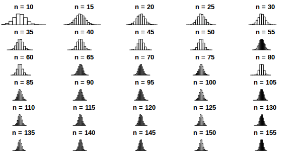

# Interactive Jobs

When you first log on to the RCE you are on a *login node*. The login
nodes are not designed for intensive computation; the purpose of the
login nodes is to provide access to the *interactive nodes* and the
*batch nodes*. Interactive jobs are useful when a) you need a lot of
memory (e.g., because you need to load a large dataset into memory),
and/or b) you want to use multiple cores to speed up your computation.

## Launching applications on the interactive nodes

Running applications on the interactive nodes is very easy; just log in
*using NoMachine* and launch your application from the
`Application --> RCE Powered` menu. A dialog will open asking you how
much memory you need and how many CPUs, and then your application will
open. That's all there is to it! Well, we should say that the RCE is a
shared resource, so please *try not to request more memory or CPUs than
you need*. Also, applications running on the interactive nodes will
expire after five days; you can request an extension, but if you fail to
do so your job will be terminated 120 hours after it starts.

## Available RCE powered applications

Available RCE powered applications include:

-   Gauss
-   Mathematica
-   Matlab/Octave
-   R/RStudio
-   SAS
-   Stata (MP and SE)
-   StatTransfer

Other applications (e.g., Python/IPython, perl, tesseract, various Unix
programs and utilities) can be run on the interactive nodes by launching
a terminal on an interactive node
(`Applications --> RCE Powered --> RCE Shell`) and launching your
program from the command line.

If you are using the interactive nodes primarily for the large memory
they provide you should have all the information you need to begin
taking advantage of the RCE. If you are also interested in using
multiple CPU cores to speed up your computations, read on! The following
sections contain examples illustrating techniques for utilizing multiple
cores on the RCE.

## Using multiple CPUs in interactive jobs

This section illustrates how to take advantage of multiple cores when
running interactive jobs on the RCE, with the goal of getting CPU
intensive tasks to run faster.

### Using multiple CPUs in interactive R programs

1.  Using multiple cores to speed up simulations

    Running computations in parallel on multiple cores is often an
    effective way to speed up computations. This can be especially
    useful when doing simulations, or when using resampling methods such
    as bootstrap or permutation tests. In this example parallel
    processing is used to simulate the sampling distribution of the mean
    for samples of various sizes.

    We start by setting up a helper function to repeatedly generate a
    sample of a given size and calculate the sample mean.

    ``` {.r}
    ## function to generate distribution of means for a range of sample sizes
    meanDist <- function(n, nsamp = 5000) {
      replicate(nsamp, mean(rnorm(n)))
    }

    ## range of sample sizes to iterate over
    sampSizes <- seq(10, 500, by = 5)

    ```

    Next iterate over a range of sample sizes, generating a distribution
    of means for each one. This can be slow because R normally uses only
    one core:

    ``` {.r}
    system.time(means <- lapply(sampSizes, meanDist))
    ```

    The simulation can be carried out much more rapidly using `mclapply`
    instead:

    ``` {.r}
    library(parallel)
    system.time(means <- mclapply(sampSizes, meanDist, mc.cores = 7))
    ```

    Like `lapply` the `mclapply` function returns a list, which we can
    process as usual. For example, we can construct histograms of the
    sampling distributions of the mean that we simulated above:

        ## plot the distribution of means at various sample sizes
        par(mfrow=c(6, 5), mar = c(0,0,2,2), cex = .7)
        for(i in 1:30) {
          hist(means[[i]],
               main = paste("n =",
                            sampSizes[i]),
               axes = FALSE,
               xlim = range(unlist(means)))
        }

    

2.  Using multiple cores to speed up computations

    In the previous example we generated the data on each iteration.
    This kind of simulation can be useful, but often you want to
    parallelize a function that processes data from a (potentially
    large) number of files. This is also easy to do using the parallel
    package in R. In the following example we count number of characters
    in all the text files in the texlive directory.

    ``` {.r}
    ## List the files to iterate over
    textFiles<- list.files("/usr/share/texlive/",
                           recursive = TRUE,
                           pattern = "\\.txt$|\\.tex$",
                           full.names = TRUE)

    ## function for counting characters (NOTE: this example isn't realistic -- it
    ## would be better to use the unix "wc" utility if you were doing this
    ## in real life...)
    countChars <-  function(x) {
      sum(nchar(readLines(x, warn = FALSE), type = "width"))
    }
    ```

    We have `length(textFiles)`{.r .rundoc-block rundoc-language="r"}
    text files to process. We can do this using a single core:

    ``` {.r}
    system.time(nchars <- unlist(lapply(textFiles, countChars)))
    ```

    but this is too slow. We can do the computation more quickly using
    multiple cores:

    ``` {.r}
    system.time(nchars <- unlist(mclapply(textFiles, countChars, mc.cores = 7)))
    ```

    and calculate the total number of characters in the text files by
    summing over the result

    ``` {.r}
    sum(nchars, na.rm = TRUE)
    ```

    For more details and examples using the parallel package, refer to
    the [parallel package
    documentation](https://stat.ethz.ch/R-manual/R-devel/library/parallel/doc/parallel.pdf)
    or run `help(package = "parallel")` at the R prompt. For other ways
    of running computations in parallel refer to the [HPC task
    view](http://cran.r-project.org/web/views/HighPerformanceComputing.html).

### Using multiple CUPs in Python

Running computations in parallel on multiple cores is often an effective
way to speed up computations. This can be useful when we want to iterate
over a set of inputs, e.g., applying a function to each of a set of
files. In this example we count the number of characters in all the
files under the texlive directory.

``` {.python}
import os
import fnmatch
textFiles = []
for root, dirnames, filenames in os.walk('/usr/share/texlive'):
    for filename in fnmatch.filter(filenames, '*.tex') + fnmatch.filter(filenames, "*.txt"):
        textFiles.append(os.path.join(root, filename))
```

We have `len(textFiles) 2080` text files to process. We can do this using a
single core:

``` {.python .rundoc-block rundoc-language="python" rundoc-results="silent"}
import time
start = time.time()

num_chars = 0
for fname in textFiles:
    try:
        with open(fname, 'r') as f:
            for line in f:
                num_chars += len(line)
    except:
        pass

stop = time.time()
```

It takes around `print(stop - start) 1.27` seconds to
count the characters in these files, which is aleady pretty fast. But,
for even more speed we can use the `multiprocessing` library to perform
the operation using multiple cores:

``` {.python .rundoc-block rundoc-language="python" rundoc-results="silent"}
import multiprocessing

def f(fname):
    num_chars = []
    try:
        with open(fname, 'r') as this_file:
            for line in this_file:
                num_chars.append(len(line))
    except:
        pass
    return sum(num_chars)

start = time.time()

pool = multiprocessing.Pool(7)
nchar = pool.map(f, textFiles)
pool.close()
pool.join()

end = time.time()
```

which reduces the time to `print(end - start) 0.33` seconds.

### Using multiple CPUs in other programming languages and applications

Using multiple CPU cores in Stata, Matlab and SAS does not require
explicit activation -- many functions will automatically use multiple
cores if available. For Matlab user-written code can also take advantage
of multiple CPUs using the `parfor` command. Python uses can run
multiple processes using the
[multiprocessing](https://docs.python.org/2/library/multiprocessing.html)
library.
