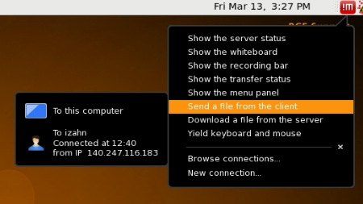

# RCE setup

## Accessing the RCE

You can access the RCE using the
[NoMachine](http://projects.iq.harvard.edu/rce/nx4_installation) remote
desktop software, or via the command line using `ssh`. If you are a
command line wizard and only need to run batch jobs `ssh` is the way to
go; for most of us however `nomachine` is a much more useful way to
access the RCE. It allows you to interact with the applications on the
cluster much as you interact with applications on your local computer.

To get started, download the NoMachine client for your operating system:

-   [Windows](http://downloads.hmdc.harvard.edu/nx/4/nomachine-client-windows-latest.zip)
-   [OSX](http://downloads.hmdc.harvard.edu/nx/4/nomachine-client-osx-latest.dmg)
-   [Linux](http://downloads.hmdc.harvard.edu/nx/4/nomachine-client-linux-latest.zip)

After downloading, Windows users should right-click on the
`nomachine-client-windows-latest.zip` file and choose `Extract to here`.
Open the `NoMachine Client` folder and double-click on the .Exe files to
start the installation (the Windows zipfile contains the NX client, plus optional
    font packages. HMDC recommends installing all font packages, though
    this is not required). Mac users should double-click on the
`nomachine-client-osx-latest.dmg` and double-click on the installer
package to begin the installation.

Once you have installed the NoMachine software you should launch the
NoMachine application and set up your login credentials.

Once the application launches:

-   Click `Continue`.
-   Click `Click here to create a new connection`.
-   Keep clicking `Continue` until you get to the Hosts screen.
-   Fill in the Host field with `rce.hmdc.harvard.edu`.
-   Keep clicking `Continue` until you get to the Name screen.
-   Fill in the Name field with `RCE6` and click `Done`.

Once you have configured NoMachine you should test it out to make sure
you can connect to the RCE:

-   Click on the `RCE6` entry and then click `Connect`.
-   Fill in the user name and password fields with your RCE user name and password.
-   On the following screen click on `New virtual desktop or custom session`.
-   Click on `Create a new virtual desktop` and click `Continue`.

After completing these steps you should see an instruction screen; click
`OK` and you should see your RCE desktop, which will look something like
this:

If you have any difficulties installing NoMachine, detailed
documentation is available at <http://projects.iq.harvard.edu/rce/nx4>;
if you do not find a solution there send and email to
[help@iq.harvard.edu](mailto:help@iq.harvard.edu) and someone will assist you.

## Power at your fingertips

You can run applications on the RCE *interactively* or using the *batch*
system. If you simply want a more powerful version of your PC (e.g.,
more memory, more CPUs) then the interactive nodes are what you want. If
you want to split your task up into hundreds of pieces and run each
piece simultaneously, then you want the batch modes.

More specifically, the RCE provides three levels of service:

**Login nodes**
:   Provides access to a desktop environment (similar to Remote Desktop)
    from which you can launch applications. The login nodes should not
    be used for computationally intensive jobs; the main function of the
    login nodes is to provide access to the interactive and batch nodes.
    You access the login nodes using the NoMachine client, as described
    in *Accessing the RCE*.

**Interactive nodes**
:    Interactive nodes allow you to run applications on very powerful
    computers. You can launch applications on the interactive nodes from
    the login node desktop using the
    `Applications --> RCE Powered Applications` menu. Applications
    launched from this menu will run on more powerful machines with
    large memory resources (up to 256GB) and up to 24 CPU cores.

**Batch nodes**
:   Where interactive nodes give you access to a single very powerful
    computer, batch nodes provide a swarm of hundreds of small
    computers. You can run your computation in parallel on each of them,
    which can provide dramatically reduced compute time for many
    applications. You access the batch nodes using the *command line*
    which you can access by starting a terminal application from the
    `Applications --> Accessories --> terminal` menu.

## Project folders & shared space

When your RCE account was created a home folder was set up for you, with
*Documents*, *Downloads*, *Desktop* and other common sub-directories.
However you can only store a maximum of 5Gb in your home folder. For
larger projects you should use a *project folder*; one was probably set
up for you when your account was activated. There is a shortcut in your
home directory named *shared space*, which will contain any project
folders you have access to. You should store large data sets and other
large or numerous files in these project folders.

Project space can be used privately, or shared with collaborators (hence
the name, 'shared space'). For more details on project folders refer to
<http://projects.iq.harvard.edu/rce/book/projects-and-shared-space> and
<http://projects.iq.harvard.edu/rce/book/project-space-collaboration>.

## Getting your data on and off the RCE

People often use the RCE for memory or CPU intensive data analysis
projects. If this is your intention as well, chances are that you have
one or more (potentially large) data files that you will need to copy to
the RCE. Remember that disk space in your home directory is limited, so
if you have a large amount of data make sure to *transfer data directly
to your *project space folder**.

The simplest approach is to use the NoMachine client to transfer data
from your local machine to the RCE (and from the RCE to your local
machine). Click on the red `!M` icon in the upper right-hand corner and
select the `Send a file from the client` menu, as shown below.

If you prefer to transfer files using another file transfer client,
anything that uses ssh (e.g.,
[FileZilla](http://filezilla-project.org/)) should work. Just point your
favorite client to `rce.hmdc.harvard.edu`.
